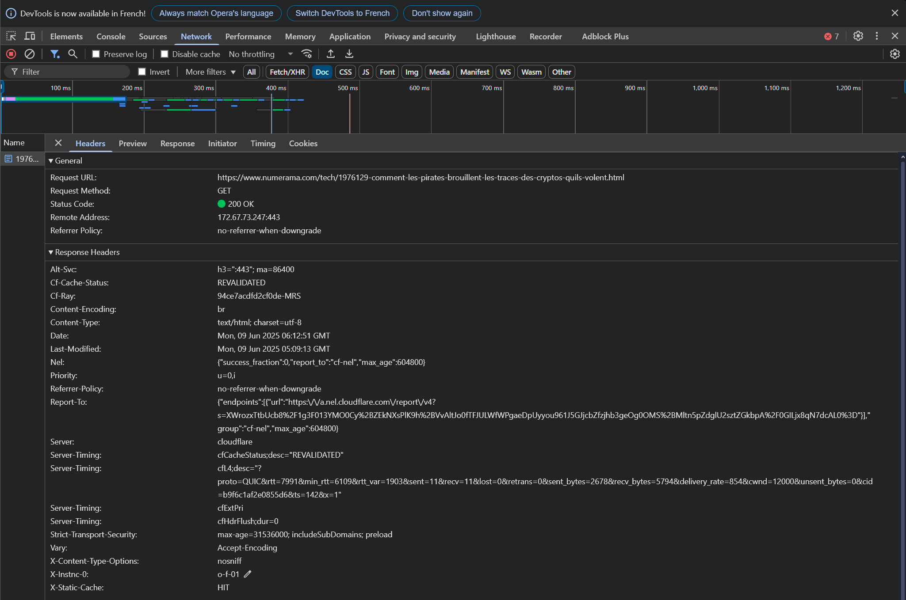
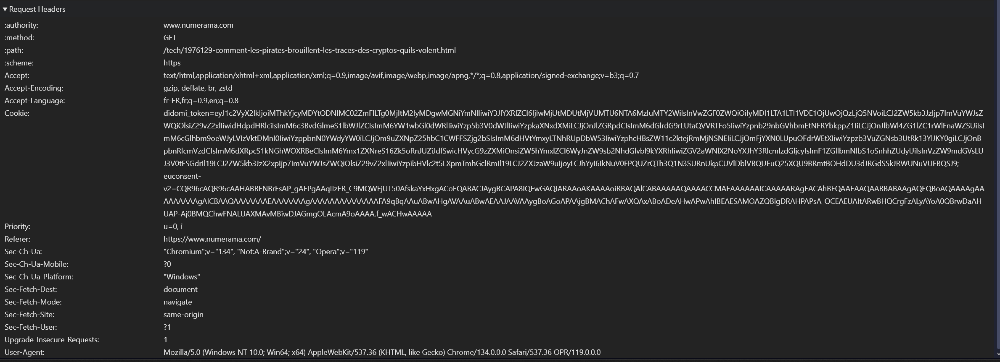
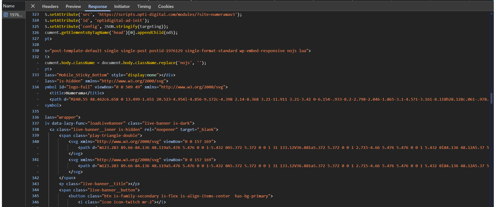

# RESTful API - Task 0: Basics of HTTP/HTTPS

This document summarizes the differences between HTTP and HTTPS,  
the structure of HTTP requests and responses,  
and lists common HTTP methods and status codes.

---

## Step 1: Summary of the differences between HTTP and HTTPS

HTTP (HyperText Transfer Protocol) is a communication protocol between a client (browser, application, etc.) and a web server.  
By default, HTTP is not secure: data is transmitted in plain text over the network and can be intercepted.

HTTPS (HyperText Transfer Protocol Secure) adds a security layer via the TLS protocol (formerly SSL). This layer ensures:

- **Confidentiality (encryption)**: data is encrypted end-to-end, preventing unauthorized reading.
- **Integrity**: any modification of exchanged data can be detected, preventing tampering.
- **Authentication**: the client can verify the server's identity through its TLS certificate.

Today, HTTPS is the standard to protect web communications, especially on e-commerce sites, banking services, user accounts, and sites processing personal data.

---

## Step 2: Structure of an HTTP request and response

### Practical example:

I visited an article on the site **https://www.numerama.com** → `/1976129-comment-les-pirates-brouillent-les-pistes-sur-internet/`.

  

#### Request details:

- **Method**: `GET`
- **Path**: `/1976129-comment-les-pirates-brouillent-les-pistes-sur-internet/`
- **Request URL**: `https://www.numerama.com/1976129-comment-les-pirates-brouillent-les-pistes-sur-internet/`
- **Status Code**: `200 OK`
- **Request Headers**:
  - Accept: `text/html,application/xhtml+xml,application/xml;q=0.9,...`
  - Accept-Encoding: `gzip, deflate, br`
  - Accept-Language: `fr-FR`
  - User-Agent: browser used
- **Body sent**: None (typical for a GET request).

  

#### Response details:

- **Response Headers**:
  - Content-Type: `text/html; charset=UTF-8`
  - Content-Length: `45.2 kB`
  - Cache-Control: present
  - Date: server date
- **Body**:
  - Complete HTML content of the article page (visible in the Response tab).

  

---

## Step 3: List of common HTTP methods

| Method  | Description | Use case |
|---------|-------------|----------|
| `GET`   | Retrieve a resource | Display a web page, retrieve data from an API |
| `POST`  | Send data to the server | Submit a form, create a new resource |
| `PUT`   | Update an existing resource completely | Update all fields of a user profile |
| `PATCH` | Update part of an existing resource | Modify only certain fields of a user profile |
| `DELETE`| Delete a resource | Delete a user account |

---

## Step 4: List of common HTTP status codes

| Code | Description | Use case |
|------|-------------|----------|
| `200 OK` | Request successfully processed | Page or resource returned normally |
| `201 Created` | New resource successfully created | Creating a user via a REST API |
| `400 Bad Request` | Malformed or invalid request | Missing parameter or incorrect syntax in a POST |
| `404 Not Found` | Resource not found | Requested page or resource does not exist on the server |
| `500 Internal Server Error` | Server-side error | Application malfunction or server unavailable |

---
